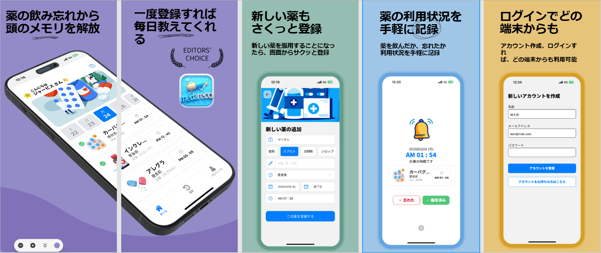

  

    
    
    
    
    
    
    
    
    
  

  <h3 align="center">Medicine Reminder App</h3>

  

    薬の飲み忘れを防ぐ習慣を記録するアプリ
  

## 📋 <a name="table">もくじ</a>

1. 🤖 [はじめに](#intro)
2. 💻 [画面一覧](#features_list)
3. 🚀 [アプリの利用サンプル](#example)
4. 🤸 [終わりに](#outro)

## <a name="intro">🤖 はじめに</a>

薬の飲み忘れを防ぎ、薬の継続を習慣化するスマホアプリ、medareco を紹介します。

## <a name="screen_list">💻 画面一覧</a>

### ログイン関連画面  

👉 オンボーディング画面
👉 ログイン画面  
👉 アカウント登録画面

|オンボーディング画面 |ログイン画面 |アカウント登録画面 |
|---|---|---|
| |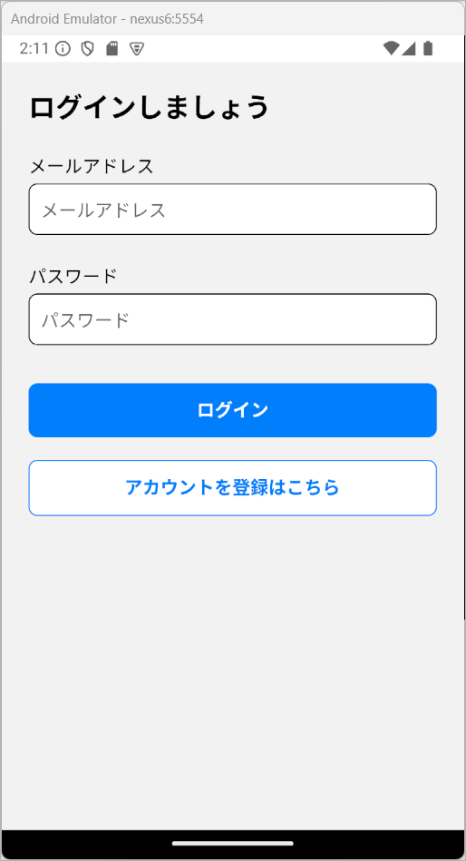 |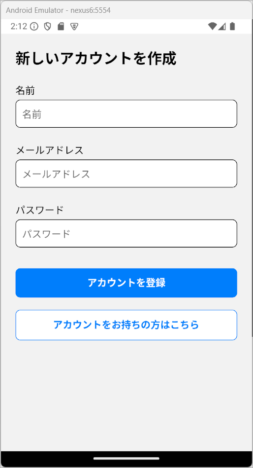 |

### タブ画面

👉 ホーム画面  
👉 履歴画面
👉 プロフィール画面 

|ホーム画面 |履歴画面 |👉 プロフィール画面 |
|---|---|---|
|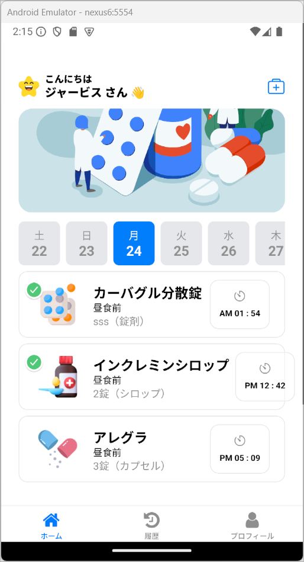 |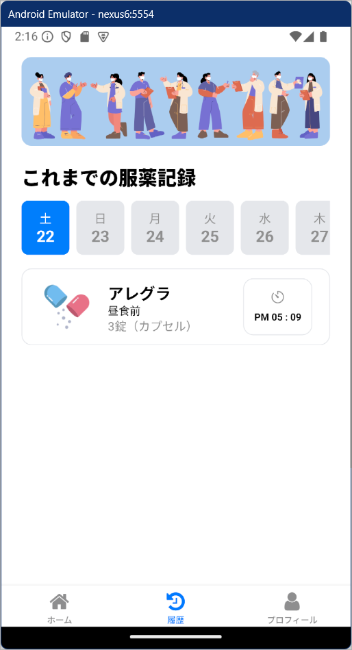 |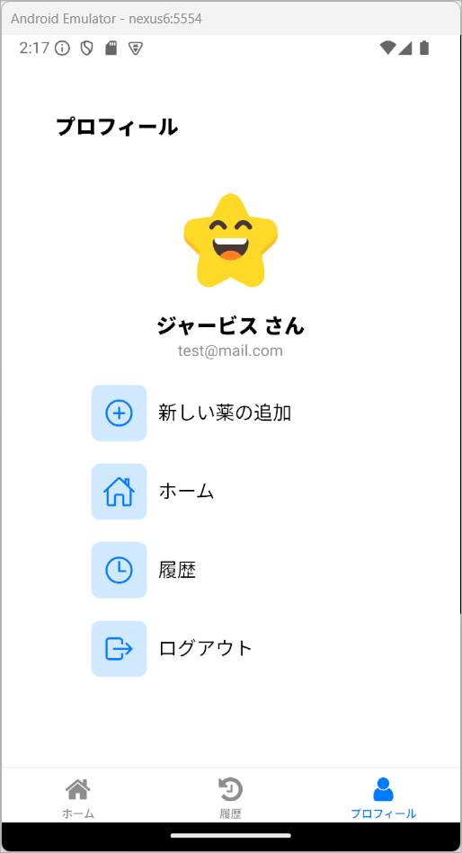 |

### 登録画面

👉 新しい薬の登録画面 

|新しい薬の登録画面 |入力内容チェック |
|---|---|
|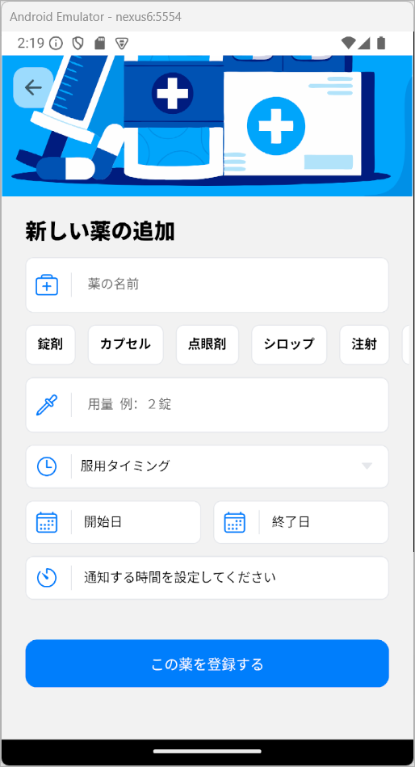 |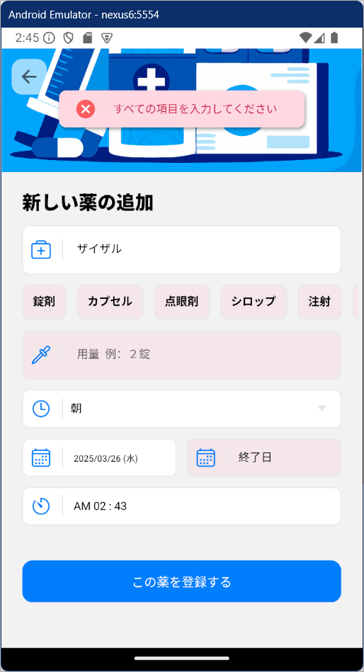 |

|カレンダ入力 |年の選択 |通知時間の設定 |
|---|---|---|
|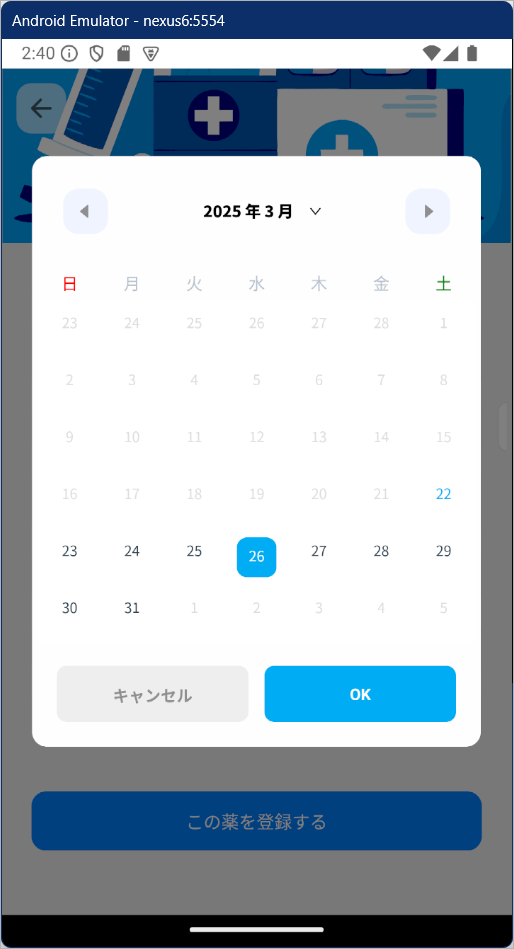 |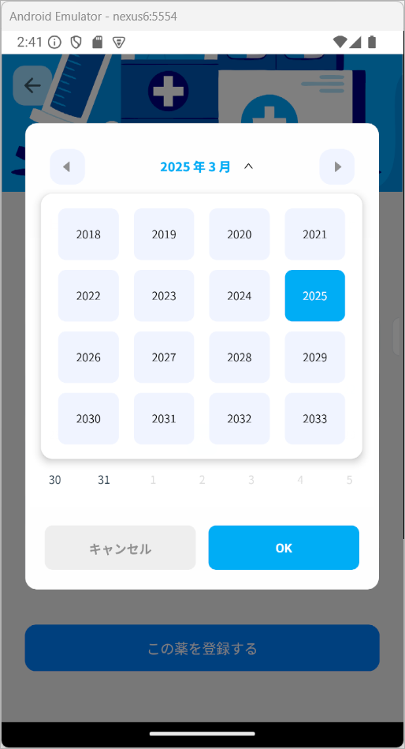 |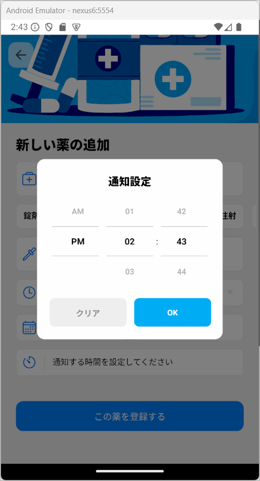 |

## <a name="example">アプリの利用サンプル</a>
ザイザル
### アカウントの作成 

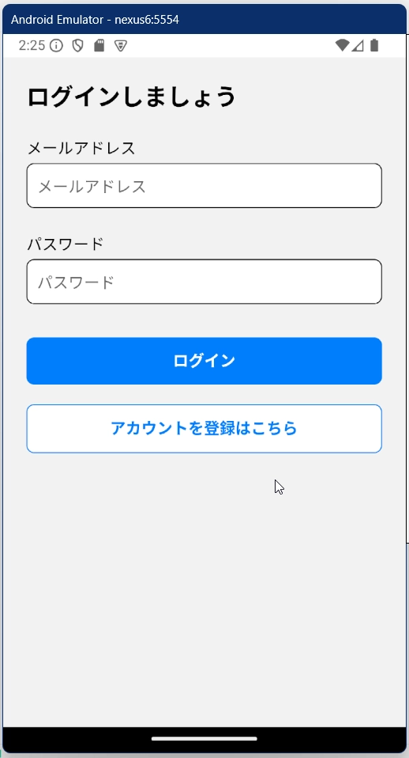

### ログアウト・ログイン 

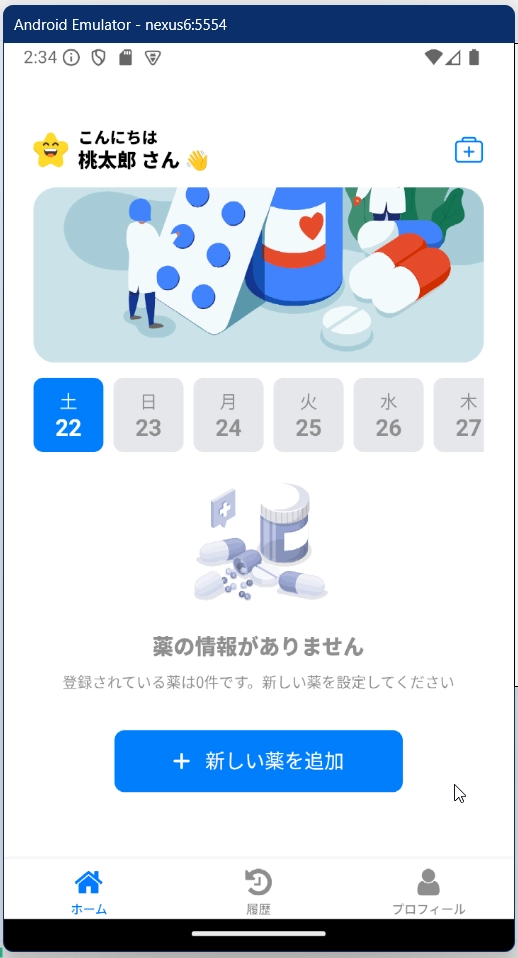

### 薬の登録 

### 薬を飲んだか忘れたかの記録 

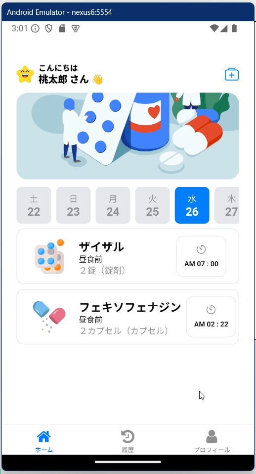
