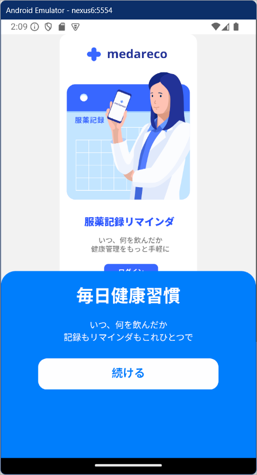

  

    
    
    
    
    
    
    
    
    
    
  

  <h3 align="center">Medicine Reminder App</h3>

  

    薬の飲み忘れを防ぐ習慣を記録するアプリ
  

## 📋 <a name="table">もくじ</a>

1. 🤖 [はじめに](#intro)
2. 🔗 [URL](#url)
3. 💻 [機能一覧](#features_list)
4. 🚀 [アプリの利用サンプル](#example)
5. 🤸 [終わりに](#outro)

## <a name="intro">🤖 はじめに</a>

薬の飲み忘れを防ぎ、薬の継続を習慣化するスマホアプリ、medareco を紹介します。

EVANS は自由にチャンネルが作成でき、グループごとに会話ができるアプリです。

## <a name="url">🔗 URL</a>

EVANS  
https://evans-one.vercel.app  

## <a name="screen_list">💻 画面一覧</a>

### ログイン関連画面  

👉 オンボーディング画面
👉 ログイン画面  
👉 アカウント登録画面

|オンボーディング画面 |ログイン画面 |アカウント登録画面 |
|---|---|---|
| 
| 
| |

### タブ画面

👉 ホーム画面  
👉 履歴画面
👉 プロフィール画面 

|ホーム画面 |履歴画面 |👉 プロフィール画面 |
|---|---|---|
| 
| 
| |

### 登録画面

👉 新しい薬の登録画面 

|新しい薬の登録画面 |
|---|
| |

## <a name="example">アプリの利用サンプル</a>

### アカウントの作成 

